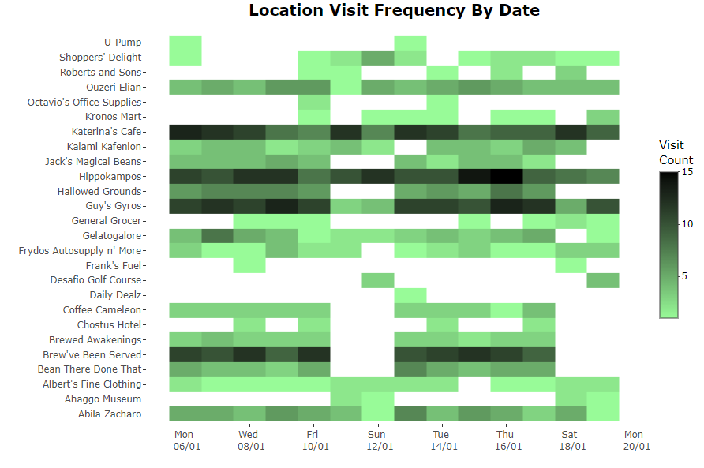
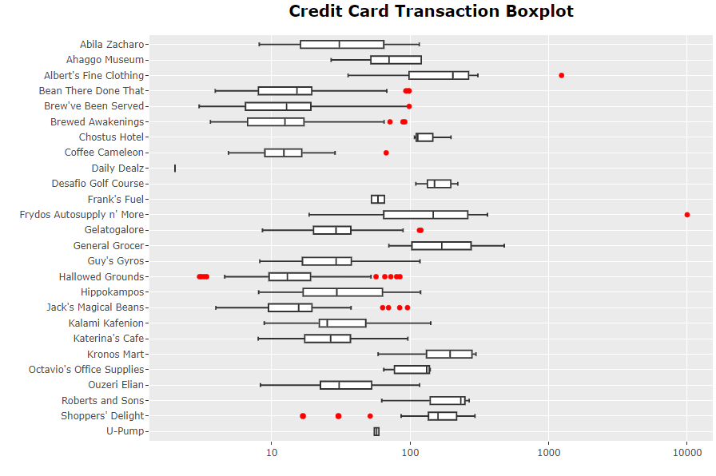
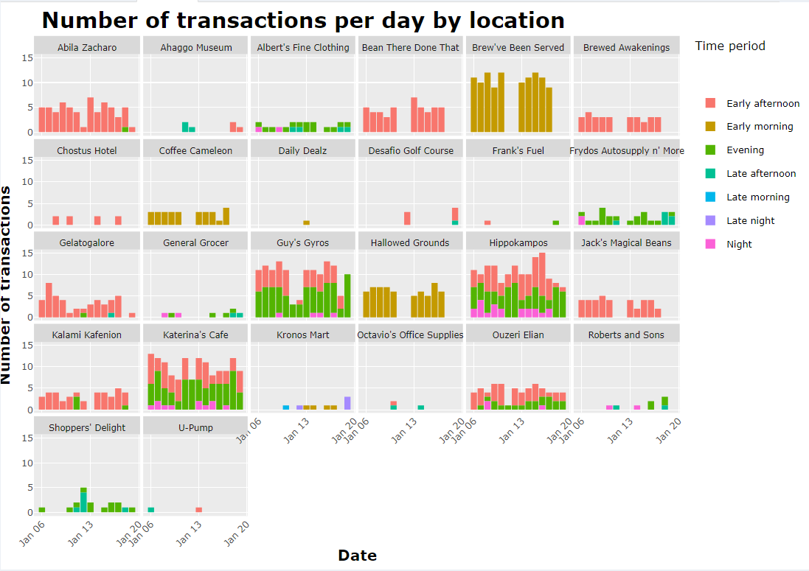
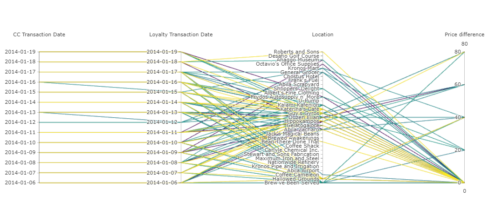
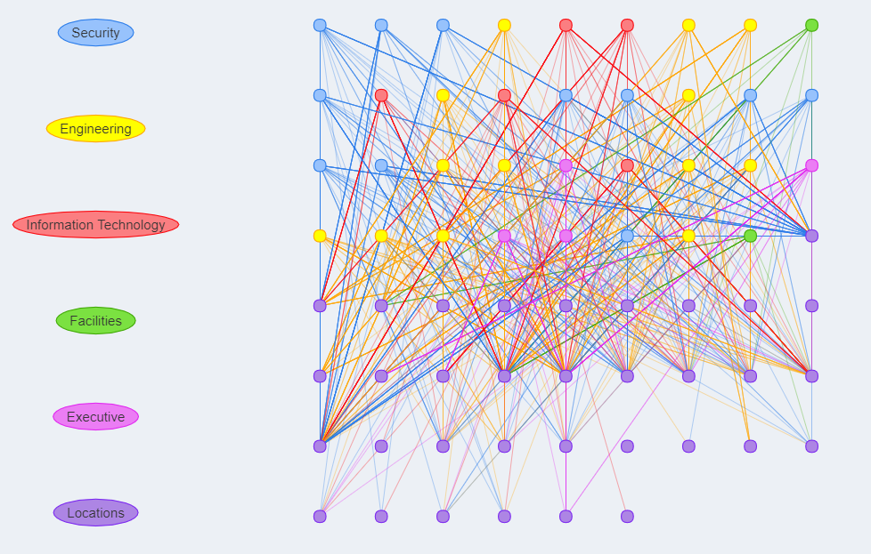

```{r, include=FALSE}
knitr::opts_chunk$set(echo = FALSE,
                      warning = FALSE,
                      tidy = FALSE,
                      message = FALSE,
                      fig.align = 'center',
                      out.width = "100%")
options(knitr.table.format = "html") 
```

<style>
#main-img-left, #main-img-center, #main-img-right {width:8%;}
</style>

# Introduction
The VAST 2021 Mini Challenge 2 outlines a hypothetical scenario in which several GAStech employees have gone missing and the organisation, Protectors of Kronos (POK), is suspected of being involved. The challenge requires identification of suspicious activities hidden in data and determine any dubious people and locations that should be reported to the law enforcement using interactive visual analytical tools.

# Motivation and Objectives
Our research and development effort aims to enable Kronos law enforcement with the ability to easily analyse, drill down and identify key suspects and suspicious locations, and thereby speeding up the investigation process. 

The use cases of the data visualisation tool include but are not limited to the following:

* The most popular locations and when they are popular
* Infer the owner of each credit card and loyalty card
* Identify potential informal or unofficial relationships among GASTech personnel
* Analyze unusual and suspicious activities of the employees 
* Analyze daily routines of GasTech employees

# Approach and Methodology
The application aims to provide users actionable insights based on the following analyses:

* Exploratory Data Analysis (EDA) of GPS tracking data and credit and loyalty card transaction patterns
* Visualisation of employee movements over time and associated purchase transactions
* Network analysis of employees based on their visited locations

# Application

The STAGEM Application was designed using R Shiny and hosted on shinyapps.io server. The application has 5 main section with various interactive visual analytics tools to allow users to investigate the data. The user guide to the application is available at [https://isss608g1group5.netlify.app/userguide.html](https://isss608g1group5.netlify.app/userguide.html).

## Abila Kronos Map
The tab shows the GPS movement data of each employee's car. Figure \@ref(fig:map) shows Abila map with each employee's car GPS movement data and stop locations. 
```{r map, fig.cap='Abila Map'}
knitr::include_graphics("img/map.png")
```
Figure \@ref(fig:scatter-plot) is a scatter plot that gives an overview of the cars that visited the specific locations during different time period of the day.
```{r scatter-plot, fig.cap='Scatter Plot of Locations visited'}
knitr::include_graphics("img/scatter-plot.png")
```
## Locations Transactions
The tab allow users to investigate GASTech employee's credit card transactions at the various locations made in Abila. There are three interactive visualisation that shares five filters where users can select by location, employee, date, time period of transaction and department of each employee to dynamically update the visualisations.

### Heatmap of Location Visit Frequency
Figure \@ref(fig:heatmap) provides an overview of the frequency of transactions at each location by date. Hovering over each region will show the micro-data of frequency count for that location by date.
```{r heatmap, fig.cap='Heatmap'}

```

### Boxplot of Credit Card Transactions
Figure \@ref(fig:boxplot) displays each credit card transaction price at varying locations. Hovering over the boxplot will display the micro-data of the median price for the location and the corresponding credit card number and transaction price.
```{r boxplot, fig.cap='Boxplot'}

```

### Barplot of Number of Transactions per Day per Location
Figure \@ref(fig:barplot) displays the number of transactions for each location by date and colored by time period. Hovering over the columns displays the micro-data of the number of transactions performed at the location on the date during the time period. 
```{r barplot, fig.cap='Stacked Barplot'}

```


## Card Mapping
Figure \@ref(fig:parcoord) displays the credit card and loyalty card mapping to each GASTech employee with reference to their car GPS data. Users can select the different credit card number in the filter to dynamic change the plot to observe the respective transactions made at the different locations. The difference in price of each matching credit card and loyalty card is also made available in the plot. Users can utilise the interactive plot to highlight different selections throughout the parallel coordinate plot.
```{r parcoord, fig.cap='Parallel Coordinate Plot'}

```

## Network Analysis
Network analysis depicts the movement of GASTech employees to corresponding locations. There are two network analysis presented based on their credit card transaction history or on their car GPS movement and locations. Figure \@ref(fig:network1) displays the network analysis based on credit card transactions. Each node represents an employee or location and each edge represents the connection between each nodes. Users can also select department to highlight the nodes of employees from the department.
```{r network1, fig.cap='Network Analysis based on Credit Card Transactions', out.width="80%"}

```

# Future Work
Future work would have to be done to integrate the different visualizations developed as the current plots are loosely coupled. One area of improvement would be to have pop-up charts upon clicking of data points on existing visualizations to showcase extended information that would be of relevance.

The scope of STAGEM could be extended to cover Mini-challenges 1 and 3 to provide a comprehensive integrated visual analytics system that helps to resolve the overarching case scenario. Additional analyses relating to mini-challenges 1 and 3 such as text analytics and sentiment analysis can help to complement findings from the existing application to provide a much more cohesive narrative to the storyline.

# Conclusion

Through the utilisation of interactive visual analytical tools in the Shiny application, users can visualise patterns and anomaly activities of the employees. The user-friendly layout incorporated with drop down filters allow users to slice the data and utilise the interactivity of each visualization to investigate the data without knowledge of programming or data analytics. 

# Acknowledgement

We would like to thank Professor Kam Tin Seong for his guidance throughout the tenure of the project.

# Project Links

Our website can be found at [https://isss608g1group5.netlify.app/](https://isss608g1group5.netlify.app/). Alternatively, scan the QR code at the bottom left to access our website.

Code for the documents and applications can be found at [https://github.com/jovinkahartanto/Visual-Analytics---Group-Project](https://github.com/jovinkahartanto/Visual-Analytics---Group-Project). Alternatively, scan the middle QR code at the bottom to access our Github.


Application can be assessed at [https://limyongkai.shinyapps.io/ISSS608T5Shiny](https://limyongkai.shinyapps.io/ISSS608T5Shiny). Alternatively, scan the QR code on the bottom right to access our Shiny Application. 


```{r eval=FALSE}
library(pagedown)
pagedown::chrome_print("Poster.html")
```
<!-- This is the `posterdown_betterport` template for the {posterdown} package! I was inspired by the twitter thread of [Mike Morrison](https://mobile.twitter.com/mikemorrison/status/1110191245035479041) and wanted to apply the `#betterposter` concept to the reproducible (yet simple to use) functionality of the {posterdown} package [@R-posterdown]. If you're not an R user don't sweat as you do **NOT** need to use it at all! Feel free to use only the Markdown functionality of this package :) -->

<!-- ```{r, include=FALSE} -->
<!-- knitr::write_bib(c('posterdown', 'rmarkdown','pagedown'), 'packages.bib') -->
<!-- ``` -->

<!-- ## Objectives -->

<!-- 1. Pick a template layout. -->
<!-- 2. Write/ create your poster content distraction free. -->
<!-- 3. Let posterdown do its thing! -->

<!-- # Methods -->

<!-- I will show here how to include poster elements that may be useful, such as an equation using mathjax: -->

<!-- $$ -->
<!-- E = mc^2 -->
<!-- $$ -->

<!-- To reference a citation you can add your `.bib` file to the working directory and name it in the YAML metadata or generate an automated one as done here, then you only need to reference the label value in the `.bib` file. For example this package is built on top of the wonderful {pagedown} package and I will cite it at the end of this sentance using this in the rmd `[@R-pagedown]` [@R-pagedown]. -->

<!-- To get a better understanding of how to include features like these please refer to the {posterdown} [wiki](https://github.com/posterdown/wiki). -->

<!-- **_Now on to the results!_** -->

<!-- # Results -->

<!-- Here you may have some figures to show off, bellow I have made a scatterplot with the infamous Iris dataset and I can even reference to the figure automatically like this, `Figure \@ref(fig:irisfigure)`, Figure \@ref(fig:irisfigure). -->

<!-- ```{r, irisfigure, fig.cap='Here is a caption for the figure. This can be added by using the "fig.cap" option in the r code chunk options, see this [link](https://yihui.name/knitr/options/#plots) from the legend himself, [Yihui Xie](https://twitter.com/xieyihui).', out.width="80%"} -->
<!-- par(mar=c(2,2,0,1)) -->
<!-- plot(x = iris$Sepal.Length, y = iris$Sepal.Width, -->
<!--      col = iris$Species, pch = 19, xlab = "Sepal Length", -->
<!--      ylab = "Sepal Width") -->
<!-- ``` -->

<!-- Maybe you want to show off some of that fancy code you spent so much time on to make that figure, well you can do that too! Just use the `echo=TRUE` option in the r code chunk options, Figure \@ref(fig:myprettycode)! -->

<!-- ```{r myprettycode, echo=TRUE, fig.cap='Boxplots, so hot right now!', fig.height=6, out.width="80%"} -->
<!-- #trim whitespace -->
<!-- par(mar=c(2,2,0,0)) -->
<!-- #plot boxplots -->
<!-- boxplot(iris$Sepal.Width~iris$Species, -->
<!--         col = "#008080", -->
<!--         border = "#0b4545", -->
<!--         ylab = "Sepal Width (cm)", -->
<!--         xlab = "Species") -->
<!-- ``` -->

<!-- How about a neat table of data? See, Table \@ref(tab:iristable): -->

<!-- ```{r, iristable} -->
<!-- knitr::kable( -->
<!--   iris[1:15,1:5], format = "html", -->
<!--   caption = "A table made with the **knitr::kable** function.", -->
<!--   align = "c", col.names = c("Sepal <br> Length", -->
<!--                              "Sepal <br> Width", -->
<!--                              "Petal <br> Length", -->
<!--                              "Petal <br> Width", -->
<!--                              "Species"), -->
<!--   escape = FALSE) -->
<!-- ``` -->

<!-- # References -->

<!-- ```{r eval=FALSE} -->
<!-- library(pagedown) -->
<!-- pagedown::chrome_print("poster.html") -->
<!-- ``` -->
