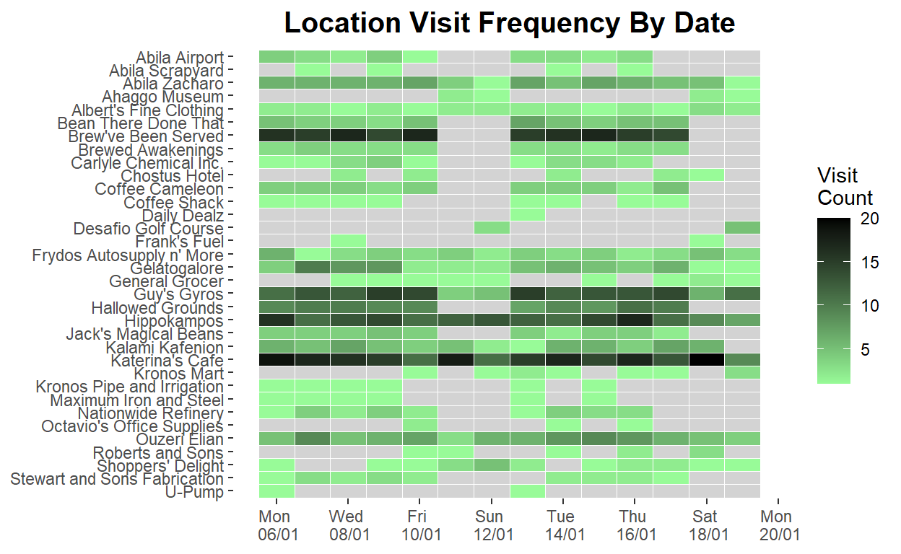
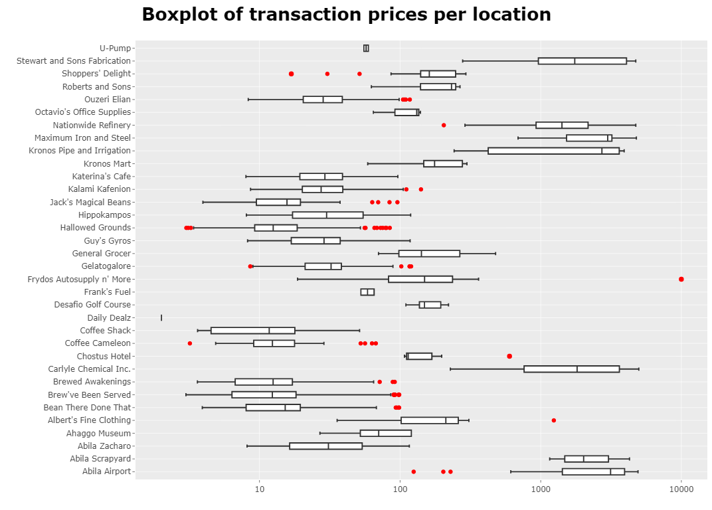
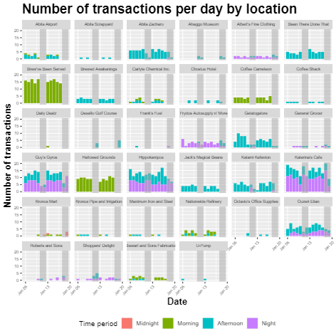
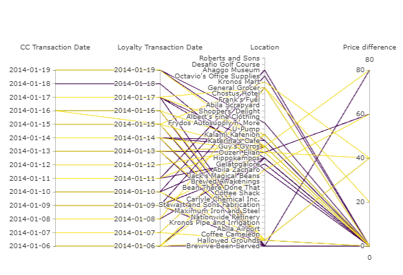
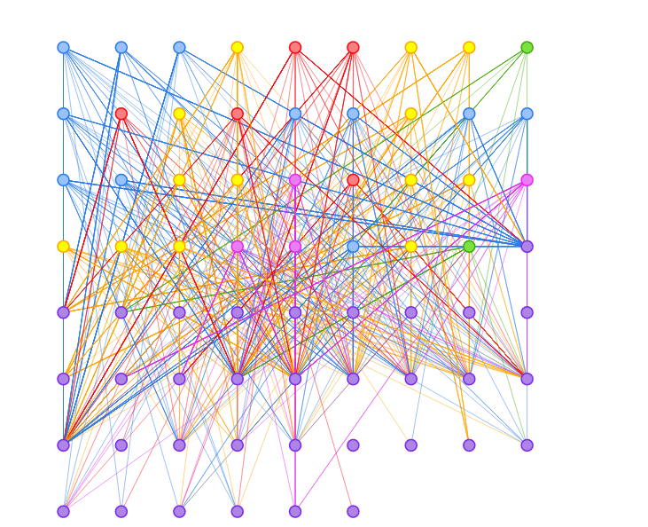
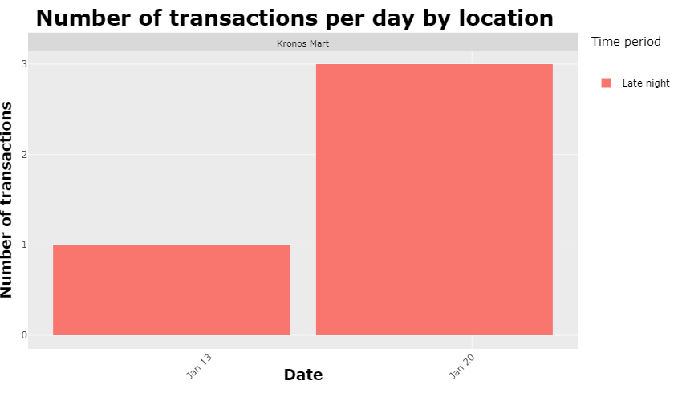
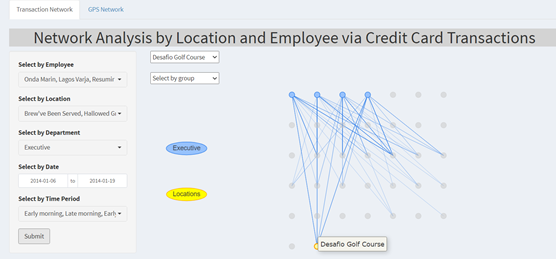
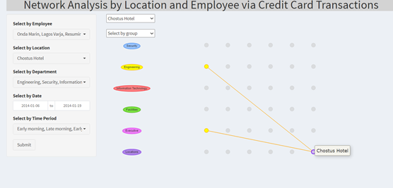
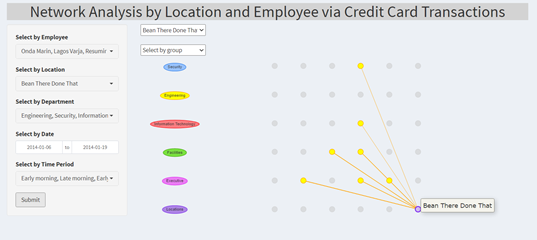

# Introduction 
The VAST 2021 Mini Challenge 2 outlines a hypothetical scenario in which several GAStech employees have gone missing and the organisation, Protectors of Kronos (POK), is suspected of being involved. The dataset includes two weeks of GPS tracking data for company cars assigned to employees, credit and loyalty card transactions of employees before the disappearance. ESRI shapefiles for the city of Abila & country Kronos are also provided. The challenge requires identification of suspicious activities hidden in data and determine any dubious people and locations that should be reported to the law enforcement.

The dataset was wrangled to develop a Shiny app, STAGEM, that aims to provide users actionable insights based on the following analyses:

* Exploratory Data Analysis (EDA) of GPS tracking data and credit and loyalty card transaction patterns
* Visualisation of employee movements over time and associated purchase transactions
* Network analysis of employees based on their visited locations

This paper details our efforts to design, create and implement a web-based analytics tool to assist users from the law enforcement to derive insights and accelerate the investigation process of the disappearance of GAStech employees. The paper consists of six sections. Section 1 presents a general introduction of the paper. Section 2  provides an overview of the motivation and objectives of our project. Section 3 provides a review of techniques used in Vast Challenge 2014 and similar spatio-temporal visualizations. This is followed by a detailed description of the design principles used and data visualization elements built, and a demonstration of the user interface in section 4 and 5. Insights and uses of the system are documented in section 5. Finally, the paper concludes by highlighting how the system can be extended or refined in the future.

# Motivation and objectives 

Our research and development effort was motivated by the general lack of effective and easy to use web-enabled data visualization tool to conduct data analysis on the GAStech employees related dataset. The project aims to enable the Kronos law enforcement the ability to easily analyze, drill down and identify key suspects and suspicious locations, and thereby speeding up the investigation process. 

The use cases of the data visualisation tool include but are not limited to the following:

* The most popular locations and when they are popular
* Infer the owner of each credit card and loyalty card
* Identify potential informal or unofficial relationships among GASTech personnel
* Analyze unusual and suspicious activities of the employees 
* Analyze daily routines of GasTech employees

# Review and critic of past works 

The project drew inspirations from previous works by Singapore Management University (SMU) students and submissions of the 2014 Vast Challenge.

In the project, Dino Holmes Series [@dinoholmes], heatmap enabled readers to easily determine patterns and trends over a time. However, static heatmap is  not reader friendly enough to determine what was the count at specific time slots. As each heatmap box represents a discrete count by using a gradient color fill, it was difficult to accurately determine the specific count. The analysis may benefit from making the heatmap plot interactive, allowing the details to be displayed at the tooltip when hover across. This would allow granularity data to be more well-presented in the report.

Submission from Fraunhofer IAIS and City University London [@fraunhofer] and RBEI-Bangalore [@rbei] both used network cluster and analysis to investigate the relationships between GAStech employees. Fraunhofer IAIS university used an ego-centric graph whereas RBEI used a combination of fragmented and node-only layout to visual the relationship by connecting employees. Network analysis is an informative visualisation that provides an overview of potential relationships between employees or even connecting employees to different mediums such as the locations or emails.

Although network analysis provides an overview of the relationships between nodes, usually the plot will be cluttered which make it difficult to drill down to specific or individual relationships. An alternative would be to make the plot interactive so that readers will be able to drill down on specific areas to investigate the relationships.

# Design framework 
The STAGEM application was built with several functionalities. 

Exploratory data analysis (EDA) with histogram, heatmap and boxplot were performed to give users an overview of GAStech employees' credit card and loyalty card transactions over the two weeks. Heatmap was used for a quick summary of the most popular locations based on transaction frequency. This function is meant for high-level visualisation and not detailed analysis. Detailed barchart faceted by location and classified by time period was used to visualise distribution and popularity of locations at different time of the day. Any transactions at odd timing could be isolated and scrutinise in detail. Boxplot shows the median and 25th and 75th percentiles of transaction amounts at each location, and to visualise any anomalies. Bar chart was chosen since it is easy to grasp without significant statistical knowledge. Interactivity is a significant feature of the EDA charts. Given that this is an exploratory phase, all dataset parameters were included as much as possible to aid the user in discovering insights.

Exploratory spatial data analysis (ESDA) investigates the location component of the provided dataset. With the Abila map and GPS routes visualised, we were able to explore the island map and determine movements and location of employees' cars at specific time periods. This was complemented by scatter plot of visits of employees by time and day at specific locations. This helps users to identify any overlaps in visit location and time of employees to determine any relationships among employees.

Parallel coordinate plot was used to map credit card and loyalty card to their respective owners since the card owners were not provided. Credit cards and loyalty cards transaction date, location and price (filtered by credit card numbers) were also mapped. 

Network analysis was performed to allow users to depict relations among employees and locations to analyse the social structures that emerged from the recurrence of these relations.

The data visualization in these four components was synchronized using a set of data filters that allowed for data manipulation and interaction coordination among multiple displays. The linked data presentation enabled the user to keep the filter selection when going between views without having to reapply the settings each time. The mouse hover tooltip provided on-demand details without having too much information cluttered on the data visual. These allowed users to follow the flow of “overview first, zoom and filter into details”, bouncing back and forth, here and there, with ease and without breaking their train of thought. 

## Data preparation

The data set was extracted from the VAST Challenge 2021 website under the sub section Mini-Challenge 2. All the data wrangling and cleaning were performed using R. The data wrangling and cleaning of transaction data and GPS data are as explained below:

1. GPS data
 * Convert the GPS data coordinates into simple feature (sf) format
 * Adding other factors to the GPS dataset such as date, hour, and time period which were extracted from the GPS timestamp column
 * ID in GPS data were matched with the car assignment data to get the employee name for each car ID
 * Transformed the data to only keep the stationary GPS coordinate for each car by determining rows where the time lag between subsequent GPS log by each car id was more than 5 minutes. 5 minutes was selected because the waiting time at a traffic lights is around 3 to 5 minutes hence the upper bound was chosen to eliminate situations where the stationary GPS coordinates were due stoppage at traffic lights. This data will later be matched with the transaction data to determine which location do the employees stop at
 
2. Transaction Data 
* Adding other factors to the transaction data, such as hour, date, and time period
* Tagged the owners of the credit card to the loyalty card number by joining the credit card and loyalty card data.
* Created nodes and edges from credit card and location data to uncover some relationship among employees. Nodes were created by combining employee information, such as employee name, car id, last 4 credit card number, and employment details with unique location name. Edges was created by joining credit card owners data with the nodes data

## Shiny Architecture

The STAGEM application was developed with Shiny, an R tool for generating interactive web apps. The main advantage of Shiny is that users can easily change the variable inputs and almost instantly see the resulting charts and figures. Not only does it allow for interactivity, it provides an invaluable tool for users to derive insights. Shiny also uses the R packages available on R-cran, which expands on the core R functions and improves the app's functionality.

The Shiny application was designed according to the flow of the Vast Challenge questions. 

i) **Overview - **A brief background of the case challenge and the 5 questions to be answered. The links to the papers, documents and source code are also appended here. 
ii) **Abila Kronos Map - **This provides a map view of employees' GPS movements filtered by time and employee.
iii) **Location Transactions - **This provides detailed transaction frequencies at various locations at different time, as well as transaction amount, enabling users to answer some of the questions posed by the case challenge.
iv) **Card Mapping - **This shows the cards ownership as well as transactions specific to individual cards.
v) **Network Analysis - **This allows users to visualise the relationships among employees and locations.

## Analysis Techniques 

### Abila Map

Thematic map was used to visualise the movement of cars using the GPS tracking data over time and was used for geospatial analysis.

**tmap** was used to design the Abila map. It offers a flexible, layer-based approach to create thematic maps and is based on the grammar of graphics.

### Scatter Plot

A scatter plot shows points that represent values of two different numeric variables (i.e., date and time period). The plot was faceted by location. The points were classified by colours representing individual employees. The position of each plot on the x- and y-axes represent the relationship between both variables. Points close to one another on the plot indicate the selected employees were at the same place on the same day, same time. 

**ggplot2** was used to create the scatter plot as it is flexible and allows for faceting by groups. The ggplot2 graph was then parsed into **plotly** which enables interactivity with tooltips.

### Heatmap

Heatmap is a graphical representation of data that utilises colour-coded systems. A heatmap is able to better represent the volume of transactions/locations within a dataset and to guide users to the most important areas through the use of colours.

**ggplot2** was used to create the heatmap of transaction frequency by location. The resultant ggplot2 graph was parsed into **plotly** which allows for interactivity with tooltips. 

### Boxplot

Boxplot displays the distribution of the data based on minimum, first quartile, median, third quartile and maximum. It is a good representation of the standard dispersion of transaction amounts at each location and thereby highlighting the outlier transactions. The parameters built in the application allow the user to change the structure and make up of the bar chart. Users are able to select specific locations, filter by employees, change the date range, as well as indicate the time period of the chart.

**gglot2** was used to create the boxplot of credit card transaction values at different locations. The outliers were highlighted in red. **plotly** was used to enhance the interactivity of the chart with tooltips.

### Bar Chart

A bar chart was used to visualise the frequency of visits at different days with varying length of bars. This chart was used to for comparing different number of visits over the period. The primary category used for the x-axis is the date variable. The chart was also faceted by location to show a more granular view. The parameters built in the application allowed the users to change the structure and make up of the bar chart. Users are able to select specific locations, filter by employees, change the date range, as well as indicate the time period of the chart.

**ggplot2** was used to create the bar chart as it is flexible and allows for faceting by groups. The ggplot2 graph was then parsed into **plotly** which enables interactivity with tooltips. As more categories were added to the chart, this helps to remove text elements from the bar charts, which tend to clutter the plot. 

### Parallel Coordinate Plot

A parallel coordinate plot was used to analyse multivariate numerical data. It allows for comparison of many quantitative variables to find patterns, similarities, clusters and relationships within the multidimensional dataset. The chart maps the credit card transactions of selected card with the respective loyalty transactions, at the same time, showing the locations of transactions and price differences between the two type of cards. 

The **MASS** library was used to build the parallel coordinate chart.

### Network Analysis

Network is a graphical representation of the relationships (edges) between variables (nodes). It provides the capacity to estimate complex patterns of relationships and the network structure can be analysed to reveal core features of the network. [@network]

**visNetwork** package was used to visualise the network, together with **igraph**'s layout on grid to present a more structured network presentation. 

# Demonstration 

The final interactive plots in the Shiny application can help to identify a wide range of insights, specifically in the area of suspicious people and locations. Some observations that answer the VAST Challenge questions are listed below.

## Abila Kronos Map Interface

Referring to the scatter plot interface, there were a number of people travelling around the city at late night during the period.

Zooming into one employee, for instance Mies Minke, we can see from the map interface his stop points during late night such as at House 4 on 2014-01-14 03:31:36 for 255.42 minutes. All suspicious locations at late night could be scrutinised in further details should the users want to investigate further.

## Locations Transactions Interface

The heatmap and barplot showed that the most popular places during weekdays are Brew’ve Been Served, Katerina’s Cafe, Guy’s Gyros, Hippokampos and Hallowed Grounds. Many places that are not open during weekends. The most frequently visited places over the weekends are Katerina’s Cafe (more popular on Saturdays) and Hippokampos.

Late night transactions are relatively more suspicious and hence are shown in isolation. Noticed 4 transactions were made on different credit cards at Kronos Mart at late night on various days. 

 
In the boxplot, there was an extreme outlier of a 10,000 dollars spent by credit card 9551 at Frydos Autosupply n'More while the median price was only 149 dollars. Further analysis on this credit card is done using the Card Mapping interface. 

There was also an outlier of 1,239 dollars at Albert's Fine Clothing. However, looking at the frequency of transactions at Albert’s Fine Clothing, it seems like a common place to buy clothing. Possible deduction was the person was buying lots of clothing for his family or friends, amounting to a much higher price than usual.

## Card Mapping

Credit card 9551 was mapped to loyalty card L5777 based on transaction details and to Nils Calixto, IT Helpdesk, based on his GPS locations. Noticed that the $10,000 transaction made at Frydos Autosupply n'More spent on this credit card was not mapped in the plot. This shows that the transaction was not accompanied with a loyalty card and may or may not be made by Nils Calixto. This prompts further investigation as it raises the suspicious level of the said transaction.

## Network Analysis

The network formed from the credit card transaction locations as well as GPS tracking data locations was displayed using network analysis. From the network analysis throughout the two weeks of data, we uncovered some relationships among employees.

Desafio Golf Course was visited by GAStech Executives only as shown by the Network Analysis by Credit Card Transactions. They might be playing golf or a regular gathering at the location.

Chostus Hotel was visited by Orilla Elsa and Tempestad Brand. Cross referencing to the scatter plot under Abila Kronos Map, we can observe that both Orilla Elsa and Tempestad Brand made transactions on 4 same dates during lunch time. The transactions were relatively expensive for a lunch meal in comparison to other food and beverage location in Abila. Alternatively, they might have paid for a hotel room during their visit to the location. Furthermore, both of them are from the same department with the same title in GAStech and there might be some relationship between them.
 
 

 

Bean There Done That location had only transactions made by the engineering department (yellow nodes). Bean There Done That is the furthest location from GAStech but a certain group of customers still visits and purchase from them. Visualising the GPS stationary data for the 7 customers from the engineering team, we observe that 5 out of 7 of the customers resides in the area of Carnero Street and Parla Park whereas the remaining 2 customers, Frente Birgitta and Dedos Lidelse resides between Arkadiou Park and Sannan Park. The 2 customers residential location are at the same coordinates yet far away from Bean There Done That. However, they still patronise and purchase from there might signify some relationship between both of them.
 
 

# Discussion 

The following feedback was given by users of the application. While the individual interfaces in the application serve their own purpose, there was a disconnect among the various charts to facilitate a smooth analysis of information.

The user guide was useful especially for the non-technical users to help them navigate the application easily. The interactivity such as the drop-down box and date range selection also makes it more intuitive to use for users.

# Future Work

The capabilities of the application to enable users to examine and analyze the transactions and GPS data collected is demonstrated in the above sections. Future work would have to be done to integrate the different visualizations developed as the current plots are loosely coupled. The existing application has slight disconnect between the map and transactions interfaces. While the users can independently filter both visualisations by employees and locations, it does not provide a coherent narrative and flow in the process of investigation of suspicious locations and people. One area of improvement would be to have pop-up charts upon clicking of data points on existing visualizations to showcase extended information that would be of relevance.

Mini-challenges 1 and 3 can also be attempted and incorporated into the application to provide a comprehensive integrated visual analytics system that helps to resolve the overarching case scenario. Additional analyses relating to mini-challenges 1 and 3 such as text analytics and sentiment analysis can help to complement findings from the existing application to provide a much more cohesive narrative to the storyline.

# Acknowledgement

The authors wish to thank Professor Kam Tin Seong of Singapore Management University for his support and guidance throughout this project.

# References

---
references:
- id: dinoholmes
  title: Dino Holmes Series
  author:
  - family: Ong
    given: Han Ying
  URL: 'https://wiki.smu.edu.sg/1617t1ISSS608g1/ISSS608_2016-17_T1_Assign3_Ong_Han_Ying'
  type: article-journal
  issued:
    year: 2017
- id: fraunhofer
  title: FIAIS-Andrienko-MC2: VAST Challenge 2014 Mini-Challenge 2
  author:
  - family: Andrienko
    given: Natalia
  - family: Andrienko
    given: Gennady
  - family: Fuchs
    given: Georg
  type: article-journal
  URL: https://www.cs.umd.edu/hcil/varepository/VAST%20Challenge%202014/challenges/MC2%20-%20Patterns%20of%20Life%20Analysis/entries/Fraunhofer%20IAIS%20and%20City%20University%20London/
  issued:
    year: 2014
- id: rbei
  title: RBEI-IYER-MC2: VAST Challenge 2014 Mini-Challenge 2
  author:
  - family: Singhal
    given: Manik
  - family: Lekkala
    given: Prakash
  - family: Shankar M R
    given: Shiva
  - family: Iyer
    given: Parameshwaran
  type: article-journal
  URL: https://www.cs.umd.edu/hcil/varepository/VAST%20Challenge%202014/challenges/MC2%20-%20Patterns%20of%20Life%20Analysis/entries/RBEI-Bangalore/
  issued:
    year: 2014
- id: network
  title: DNetwork analysis: a brief overview and tutorial, Health Psychology and Behavioral Medicine
  author:
  - family: Hevey
    given: David
  type: article-journal
  issued:
    year: 2018
...

