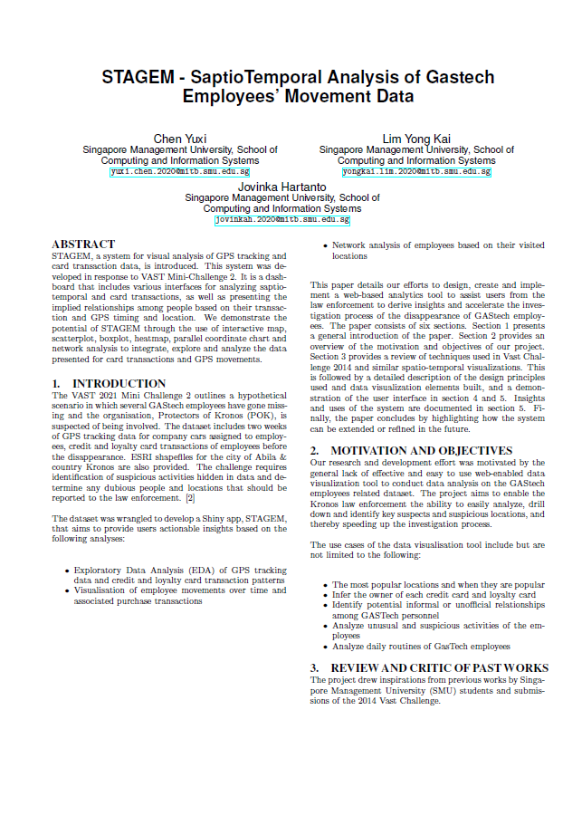
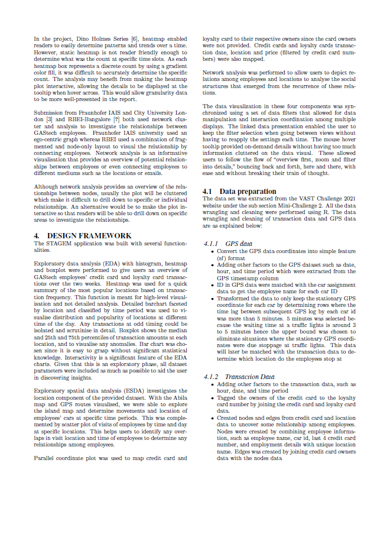
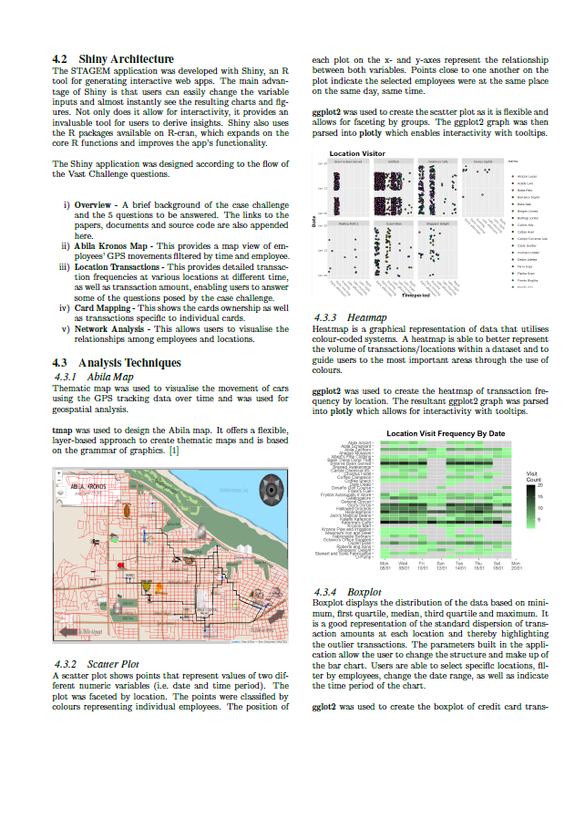
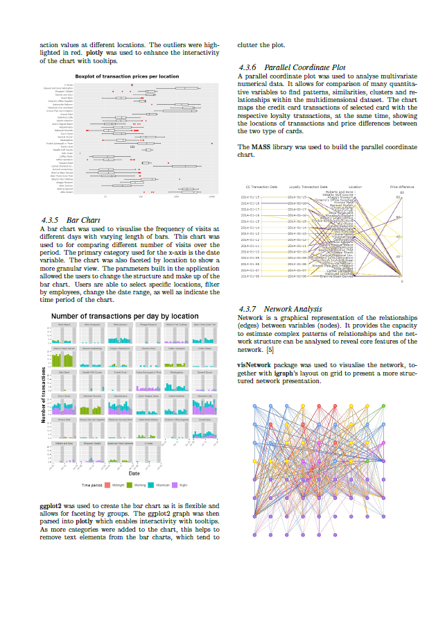
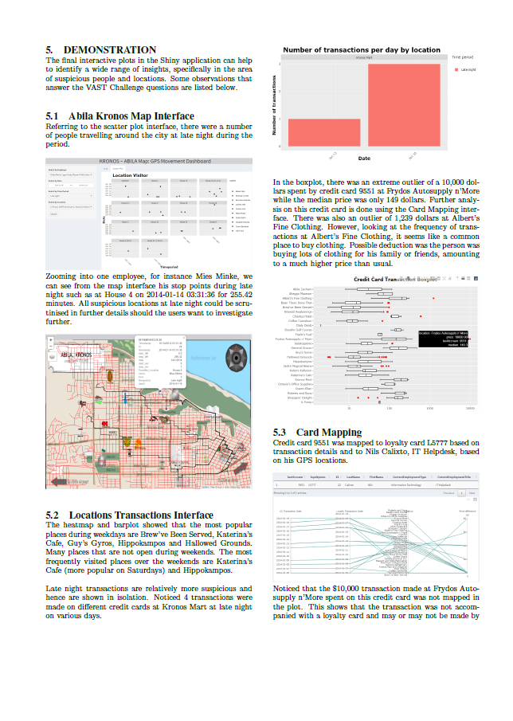
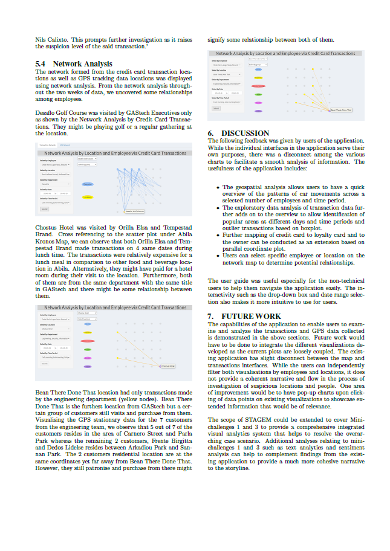
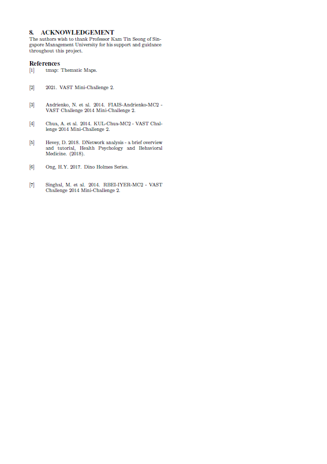

```{r setup, include=FALSE}
knitr::opts_chunk$set(echo = TRUE)
```

The link to our full research paper can be found [here](./researchpaper.pdf).


```{r, echo=FALSE, message=FALSE, out.width="100%", out.height="100%", fig.align="center"}







```