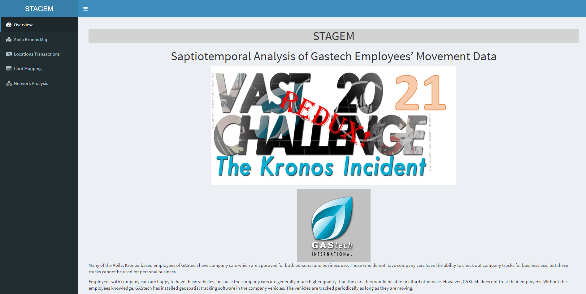
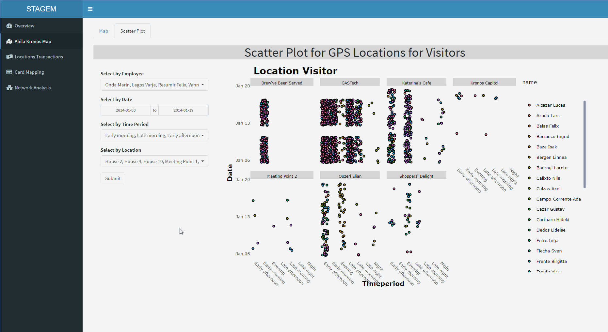
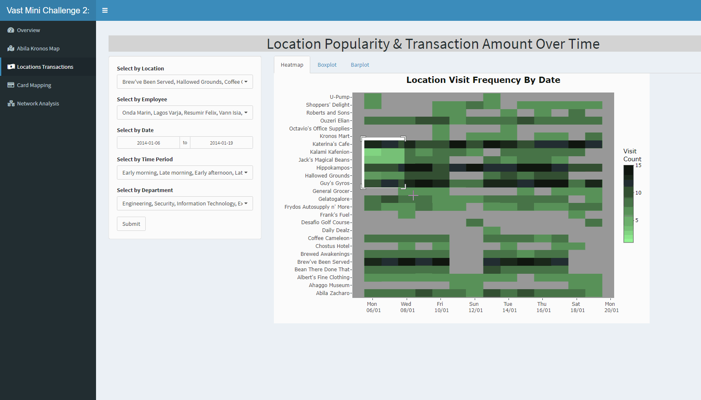

```{r setup, include=FALSE}
knitr::opts_chunk$set(echo = TRUE)
```

# Application

* The application designed using R Shiny is available on [shinyapps.io](https://limyongkai.shinyapps.io/ISSS608T5Shiny/)
* The source code for the R Shiny application is available on [Github](https://github.com/jovinkahartanto/Visual-Analytics---Group-Project/tree/master/ISSS608T5Shiny)

# User Guide for Shiny Application

## 1.0 Overview

Entering the application will bring the user to the overview page. The overview page summarise the background information of the mini challenge and the 5 questions that the Shiny application will answer using visual analytic tools. 

The papers, documents and source code are available via the link to the website and Github.

```{r, fig.align = 'center',layout="l-page", fig.cap = 'Overview Tab', echo=FALSE}

```

## 2.0 Abila Kronos Map

The tab plots the GPS movement data of each employee's car.

### 2.1 Filter Selection Panel
On the left side panel, four filters are available for user to select multiple inputs to change both interactive visualisations. *Employee*, *Time Period* and *Location* are drop down filters with multiple selection available. *Date* is a range filter between 6 January 2014 to 19 January 2014.

Figure \@ref(fig:map-filter-gif) shows selection with choices from the *Employee*, *Time Period* and *Location* filters, *Date* range of 6 to 19 January. Clicking on the **Submit** button will update the visualisation accordingly to the filter selections.

```{r map-filter-gif, fig.align = 'center',layout="l-page", fig.cap = 'Abila Kronos Map: Filter Selection', echo=FALSE}
knitr::include_graphics("img/map_filter.gif")
```

### 2.2 Main Visualisation Panel

#### 2.2.1 Map 
The interactive map of Abila Kronos displays the GPS movement data of GASTech employee cars. The black lines depicts the travel path and the blue dots depicts the location where the car stop and become stationary for more than 5 minutes. User can adjust the *Employee*, *Date* and *Time Period* filters to focus on the GPS data plotted in the visualisation.

Figure \@ref(fig:map-gif) shows selection of employee *Onda Marin* on 6 January 2014. The map on the right panel dynamically changed after the **Submit** button is clicked. User can hover around the stop locations represented by blue dots to display micro data of the car owner name, time when car is stationary and its possible location.

```{r map-gif, fig.align = 'center',layout="l-page", fig.cap = 'Abila Kronos Map: Map of GASTech employee car GPS', echo=FALSE}
knitr::include_graphics("img/map-gif.gif")
```

#### 2.2.2 Scatter Plot
The interactive scatter plot displays employee's car stop location represented by a colored dot. User is able to filter the selection to drill down on specific parameters. Hovering over the dot reveal the time period and employee name of the car stop location. 

Figure \@ref(fig:scatter-gif) shows the selection of location, House 2, 4, 10 and Meeting 1 to 5. User is able to drag and select a specific section to zoom in and hover over the dots to obtain micro-data.

```{r scatter-gif, fig.align = 'center',layout="l-page", fig.cap = 'Abila Kronos Map: Scatter Plot of GASTech employee car stop location', echo=FALSE}

```

## 3.0 Locations Transactions
The tab analyse the credit card and loyalty card transactions details to determine the most popular locations and the spending pattern for each location.

### 3.1 Filter selection Panel
On the left side panel, five filters are available for user to select multiple inputs to change all 3 interactive visualisations. *Location*, *Employee*, *Time Period* and *Department* are drop down filters with multiple selection available. *Date* is a range filter between 6 January 2014 to 19 January 2014. 

Figure \@ref(fig:location-gif) shows selection of all choices from the *Location* and *Employee* filters. The filters *Date* range is set from 12 to 19 January during the evening to night *Time Period* for employee in the *Security* department only. Clicking on the **Submit** button will update the visualisation accordingly to the filter selections.

```{r location-gif, fig.align = 'center',layout="l-page", fig.cap = 'Location Transaction Tab: Filter Selection', echo=FALSE}

```

### 3.2 Main Visualisation Panel

#### 3.2.1 Heatmap of Location Visit Frequency

The interactive heatmap visualisation displays the frequency of location visit based on the credit card and loyalty card transactions history. The color intensity of the heatmap represents the visit count for each location.

Figure \@ref(fig:heatmap-gif) demonstrates the interactivity of the heatmap. User is able to drill down on any particular period by drag and selecting the area. Hovering over each square will display micro information, including the exact visit frequency count.

```{r heatmap-gif, fig.align = 'center',layout="l-page", fig.cap = 'Heatmap: Location Visit Frequency By Date', echo=FALSE}

```

#### 3.2.2 Boxplot of Credit Card Transactions

The interactive boxplot visualisation displays the credit card transaction value for each location and the outliers shaded in red.

Figure \@ref(fig:boxplot-gif) demonstrates the interactivity of the boxplot. User can hover to display the individual transaction with the median spending shown for the location on the boxplot. User is able to drill down on any particular area by drag and selecting the area. 

```{r boxplot-gif, fig.align = 'center',layout="l-page", fig.cap = 'Boxplot: Credit Card Transaction Boxplot', echo=FALSE}

```

#### 3.2.3 Barplot of Number of Transactions per Day per Location

The interactive barplot visualisation displays the credit card transaction frequency per day for each location colored by time period. 

Figure \@ref(fig:barplot-gif) demonstrates the interactivity of the barplot. User can hover over the each bar section to display the micro data of each day within the time period. 

```{r barplot-gif, fig.align = 'center',layout="l-page", fig.cap = 'Barplot: Number of Transactions per Day by Location', echo=FALSE}

```

## 4.0 Card Mapping

The interactive parallel coordinate plot in figure \@ref(fig:parcoord-gif) displays the credit card and loyalty card transactions. The filter on the left panel allows user to select multiple Credit Card numbers for display in the right panel. The main panel on the right displays a DataTable of the credit card and loyalty card owners detail at the top and the parallel coordinate visualisation at the bottom. 

The parallel coordinate plots has 4 verticals:
1. *Credit Card Transaction Date*
2. *Loyalty Card Transaction Date*
3. *Location of transaction*
4. *Price difference between credit card and loyalty card transaction*

User can drag and select the verticals on the interactive Parallel Coordinate Visualisation to highlight only the transactions as per figure \@ref(fig:parcoord-gif),

```{r parcoord-gif, fig.align = 'center',layout="l-page", fig.cap = 'Parallel Coordinate Plot: Credit Card and Loyalty Card Mapping', echo=FALSE}

```

## 5.0 Network Analysis

The tab displays two network analysis of Employee and the location based on their credit card transactions or car GPS movement.

### 5.1 Network Analysis by Credit Card Transaction

On the left side panel, five filters are available for user to select multiple inputs to change the network graph. *Location*, *Employee*, *Time Period* and *Department* are drop down filters with multiple selection available. *Date* is a range filter between 6 January 2014 to 19 January 2014. Clicking on the **Submit** button will update the visualisation accordingly to the filter selections.

On the right side panel, the interactive network analysis shows the interaction between employees and the location they patronise based on their credit card transaction data. Users can click the nodes to highlight all interaction edges linked to the node. For example, user can click on a locations nodes to display all interaction edges to employees nodes whom has made transaction at the location. Alternatively, user can change the node selection from the drop down bar labelled *Select by id* to select a particular employee or location. User can select different group of nodes categorised by their department or the location. Figure \@ref(fig:trans-network) shows the network analysis.

```{r trans-network, fig.align = 'center',layout="l-page", fig.cap = 'Network Analysis Tab: Network Analysis by Location and Employee via Credit Card Transactions', echo=FALSE}

```

### 5.2 Network Analysis by employee car GPS locations

On the left side panel, the five filters are identical to the network analysis by credit card transaction with the addition of few more option for location selection. The locations are based on the employees car GPS stop location and it includes their residential address and suspicious meeting point with no point of interest nearby.

User can filter and select the interactive network analysis visualisation similar to the previous section. Figure \@ref(fig:gps-network) displays the interactive aspects of the network analysis visualisation. 

```{r gps-network, fig.align = 'center',layout="l-page", fig.cap = 'Network Analysis Tab: Network Analysis by Location and Employee via car GPS locationS', echo=FALSE}

```

